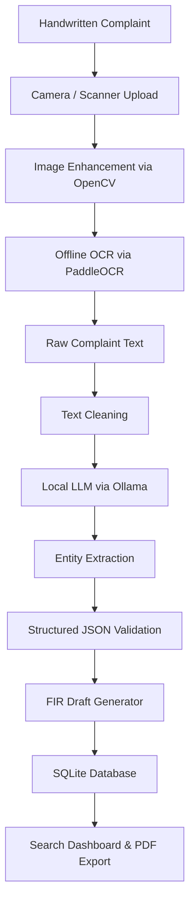

# FIRStruct AI

### Offline AI-Powered Handwritten Complaint to Structured FIR Generator

An **offline-first, CPU-optimized AI application** designed for police stations and law enforcement agencies to transform **handwritten or printed complaints** into **structured FIR drafts** without requiring an internet connection.

## 🎯 Problem Statement

Police departments continue to rely on handwritten complaints for crime reporting. Current challenges include:
- Manual reading of handwritten complaints is time-consuming and error-prone.
- Preparing FIRs takes significant time away from field work.
- It is difficult to digitally search past handwritten complaints.
- Sensitive citizen information cannot be securely uploaded to cloud-based AI tools.
- Limited internet connectivity in rural police stations limits tech adoption.

FIRStruct AI automates this entire workflow securely and entirely on the local machine.

## 🚀 Objective

Build an offline AI assistant capable of converting unstructured handwritten complaints into structured FIR information. Instead of manually reading multiple pages, officers receive a structured report containing:
- Victim & Accused Details
- Incident Summary, Crime Type, Date, Time, Location
- Vehicle Numbers & Weapons Used
- Suggested IPC/BNS Sections
- A ready-to-review FIR Draft

**Everything is stored locally. No cloud. No internet. No external APIs.**

## ✨ Key Features
- **100% Offline**: Works without internet. No data sharing. Ensures absolute privacy.
- **Universal Document Support**: Supports handwritten complaints, printed complaints, mobile camera images, and now **Multi-page PDFs**.
- **Smart PDF Processing**: Auto-detects text-based PDFs to extract text natively (saving CPU time), while falling back to page-by-page OCR for scanned PDFs.
- **Image Enhancement**: Cleans up noisy mobile scans using OpenCV before text extraction.
- **AI Information Extraction**: Automatically extracts legal entities using lightweight local language models (Ollama).
- **Automatic FIR Draft Generation**: Officers receive a ready-to-review FIR draft.
- **History & Search Dashboard**: Offline UI to browse, filter, view metadata, and search all past complaints across structured fields with ease.
- **Data Exporting**: Export single complaints to JSON or entire filtered tables to CSV.

## 🛠 Tech Stack

| Component | Technology |
| :--- | :--- |
| **Programming Language** | Python 3.12 |
| **Frontend** | Streamlit |
| **OCR** | PaddleOCR |
| **Image Processing** | OpenCV |
| **PDF Processing** | PyMuPDF (fitz) |
| **Local AI** | Ollama (Phi-3 Mini / Qwen2.5:3B) |
| **Database** | SQLite & Pandas |
| **PDF Export** | ReportLab |

## 🏗 High-Level Workflow & Pipeline



## 📂 Project Structure

```
firstruct-ai/
├── app.py                  # Main Streamlit entry point
├── frontend/               # Streamlit UI pages
│   ├── dashboard.py
│   ├── upload.py
│   ├── history.py
│   └── search.py
├── ocr/                    # Image processing and text extraction
│   ├── image_preprocessing.py
│   └── paddle_reader.py
├── processing/             # Text cleaning
│   ├── cleaner.py
│   └── parser.py
├── ai/                     # LLM inference and validation
│   ├── prompt.py
│   ├── extractor.py
│   └── validator.py
├── database/               # Database management
│   └── sqlite.py
├── schemas/                # JSON output schemas
│   └── fir_schema.py
├── exports/                # Report generation
│   └── pdf_export.py
├── cache/                  # File caching
├── tests/                  # Unit and integration tests
└── requirements.txt
```

## 📊 Database Schema (SQLite)

**FIR Table:**
- `id`, `complaint_id`, `victim_name`, `accused_name`, `crime_type`, `incident_date`, `incident_time`, `location`, `summary`, `status`, `created_at`, `filename`, `file_type`, `page_count`, `processing_method`, `ocr_required`, `file_hash`

**Related Tables:**
- `vehicles` (fir_id, vehicle_number)
- `weapons` (fir_id, weapon_type)
- `stolen_items` (fir_id, item_description)
- `ipc_sections` (fir_id, section_code)
## 🔮 Future Enhancements
- Voice Complaint → FIR conversion (Whisper.cpp)
- Regional Language Support (Multilingual OCR)
- Crime Hotspot Mapping
- Duplicate Complaint Detection
- Criminal History Matching

## 🚀 Setup & Installation

**Prerequisites:**
- Python 3.12
- Git

**Step 1: Install Pre-commit Hooks (Required for Development)**
This project enforces code quality, formatting, and security checks before every commit.

```bash
# Install the pre-commit package
pip install pre-commit

# Enable git hooks
pre-commit install

# To manually run all checks against all files:
pre-commit run --all-files
```

*Further instructions on how to install OpenCV, PaddleOCR, pull the Ollama model, and run the Streamlit app will go here.*
