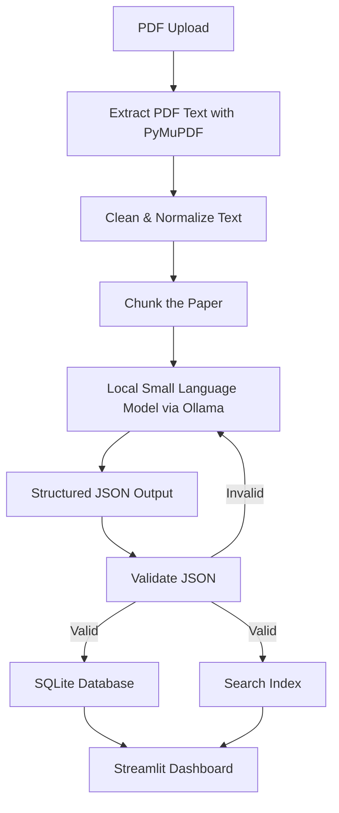

# PaperLens (ResearchIQ Offline / PaperStruct AI)

An offline-first, CPU-optimized AI application that converts unstructured research papers into structured, searchable knowledge and builds a local knowledge base.

## 🎯 Problem Statement

Researchers and students spend significant time reading lengthy research papers to identify key information such as objectives, methodology, datasets, results, limitations, and future work. Most existing AI assistants require an internet connection and upload sensitive research documents to cloud services, making them unsuitable for confidential or offline environments.

PaperLens provides an **offline-first, CPU-optimized** solution that transforms research papers into structured, searchable data entirely on the user's device.

## 🚀 Objective

Convert an unstructured research paper (PDF) into structured information using **only local AI**.

Instead of reading a 50-page PDF manually, PaperLens automatically extracts and structures:
- Title & Authors
- Abstract & Keywords
- Problem Statement
- Methodology & Algorithms
- Dataset Used
- Results & Evaluation Metrics
- Limitations & Future Work
- References

**Everything is stored locally.** No internet. No cloud APIs. No data leaks.

## ✨ Key Features
- **100% Offline**: All processing runs locally; no internet required after setup.
- **CPU-Optimized**: Uses lightweight quantized local models (e.g., Qwen2.5:3B or Phi-3 Mini) via Ollama. Chunk-based processing avoids memory exhaustion.
- **Unstructured to Structured**: Converts PDF text into a well-defined JSON schema.
- **Local Storage**: Persists extracted data in SQLite.
- **Semantic Search (Optional)**: Find papers by author, year, keyword, algorithm, dataset, or domain using FAISS.
- **Streamlit Dashboard**: User-friendly UI for uploading, previewing, and querying documents.

## 🛠 Tech Stack

| Component | Tool / Technology |
| :--- | :--- |
| **Language** | Python 3.12+ |
| **Frontend** | Streamlit |
| **PDF Parsing** | PyMuPDF |
| **OCR (Optional)** | EasyOCR (for scanned PDFs/Images) |
| **Local LLM** | Ollama (Qwen2.5:3B / Phi-3 Mini / Gemma / TinyLlama) |
| **Database** | SQLite |
| **Semantic Search** | FAISS (Optional) |

## 🏗 High-Level Workflow & Pipeline



### Processing Steps:
1. **Upload PDF**: Supports Research Papers, Conference Papers (IEEE, Springer, ACM, arXiv).
2. **Normalize Text**: Remove headers, footers, page numbers, repeated spaces, and broken lines.
3. **Chunking**: Split the paper into logical sections (Abstract, Intro, Methodology, Results) to optimize for small local models.
4. **LLM Extraction**: Instruct the model to return *ONLY* valid JSON matching our schema.
5. **Validation**: Auto-retry if the model output is invalid JSON.
6. **Storage**: Save the structured JSON into SQLite for fast retrieval.

## 📂 Project Structure

```
paperlens/
├── app.py                  # Main entry point
├── frontend/               # Streamlit UI pages
│   ├── dashboard.py
│   ├── upload.py
│   ├── search.py
│   └── history.py
├── ingestion/              # Document reading and parsing
│   ├── pdf_reader.py
│   └── parser.py
├── processing/             # Text cleaning and chunking
│   ├── cleaner.py
│   └── chunker.py
├── ai/                     # LLM inference and validation
│   ├── prompt.py
│   ├── extractor.py
│   └── validator.py
├── database/               # Database management
│   ├── sqlite.py
│   └── models.py
├── schemas/                # JSON output schemas
│   └── paper_schema.py
├── utils/                  # Helper functions
├── cache/                  # File caching to prevent duplicate processing
├── tests/                  # Unit and integration tests
└── requirements.txt
```

## 📊 Database Schema

The extracted knowledge is stored in an SQLite database with the following structure:

- **Papers Table**: `id`, `title`, `authors`, `year`, `domain`, `summary`, `json`, `created_at`
- **Keywords Table**: `paper_id`, `keyword`
- **Datasets Table**: `paper_id`, `dataset`
- **Algorithms Table**: `paper_id`, `algorithm`

## 🔮 Future Enhancements
- **Paper Comparison**: Upload two papers and generate comparisons based on methodology, datasets, and performance.
- **Knowledge Graph**: Visualize connections between papers (e.g., Paper A uses Transformer, Paper B builds on Paper A).
- **Local Chat (Q&A)**: "Which paper used CIFAR-10?" or "Find papers using reinforcement learning."
- **Multi-modal Support**: Support for DOCX, scanned PDFs (OCR), audio lectures (Whisper.cpp), and images.
- **Export Formats**: Export structured data as JSON, CSV, or Markdown summaries.

## 🚀 Setup & Installation (WIP)

*Instructions on how to install dependencies, pull the Ollama model, and run the Streamlit app will go here.*
