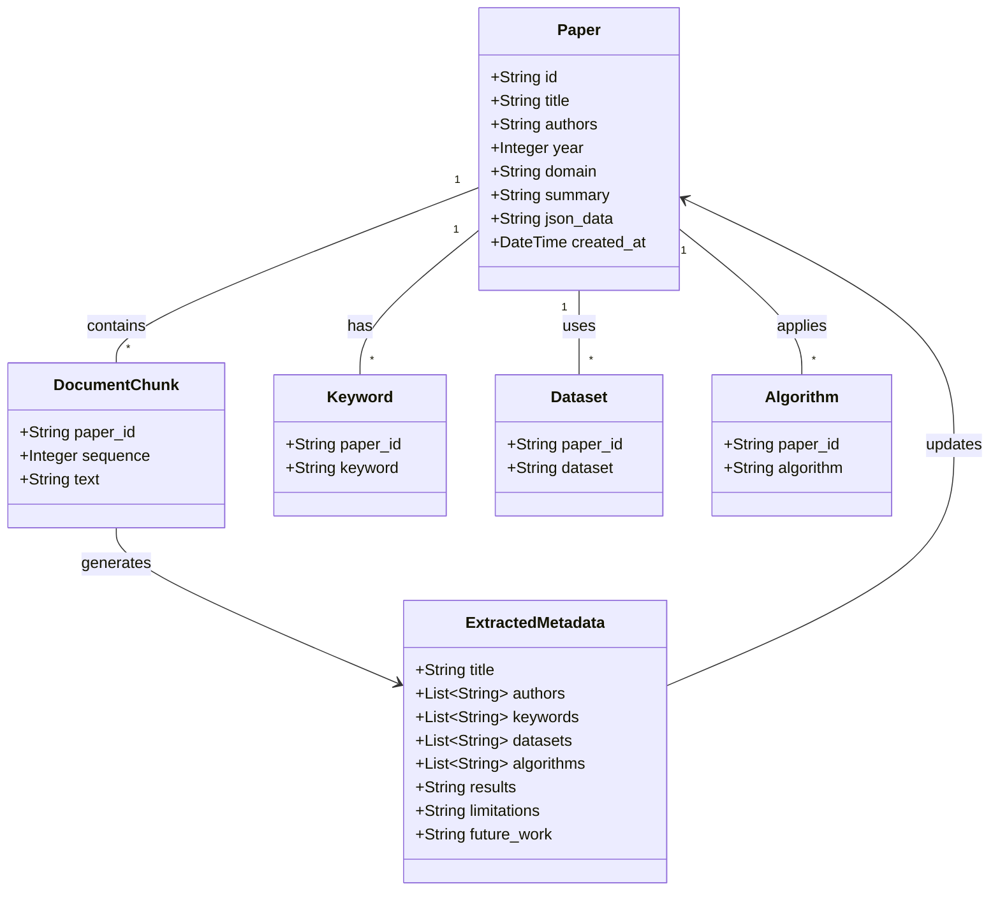

# PaperLens Offline Analyzer

## Requirements
Implement an offline-first, CPU-optimized AI application that ingests unstructured research papers (PDFs), processes them through local Small Language Models (via Ollama) using a chunking strategy, and extracts structured knowledge into a local SQLite database for searching and viewing via a Streamlit dashboard.

## Entities

## Approach
1. **System Architecture**:
   - Monolithic offline-first Streamlit application.
   - Pipelined ingestion: Document Upload -> Text Extraction (PyMuPDF) -> Text Normalization & Chunking -> Local Inference (Ollama) -> Validation -> Storage (SQLite).

2. **Technical Implementation**:
   - **Frontend**: Streamlit for a fast, interactive data dashboard.
   - **Extraction**: PyMuPDF for reliable text extraction from digital PDFs.
   - **Inference**: Ollama REST API integration for querying local quantized models (e.g., Qwen2.5:3B, Phi-3 Mini).
   - **Validation**: Pydantic models to enforce strict JSON schemas on LLM outputs, with an automatic retry loop for hallucinations.

3. **Business Logic**:
   - Implement caching using file hashing (e.g., SHA-256) to prevent duplicate processing of the same paper.
   - Handle LLM unreliability by validating JSON chunks; if parsing fails after 3 retries, gracefully fallback without crashing.

## Structure

### Dependencies
1. `Streamlit UI` calls `Ingestion Service`, `AI Extractor Service`, and `Database Service`
2. `AI Extractor Service` depends on `Prompt Builder` and `JSON Validator`
3. `Ingestion Service` depends on `Text Cleaner` and `Chunker`

### Layered Architecture
1. **Presentation Layer (`frontend/`, `app.py`)**: Streamlit components for file upload, search interface, and metadata display.
2. **AI Layer (`ai/`)**: Handles Ollama interactions, prompt engineering, and strict Pydantic JSON validation.
3. **Processing Layer (`processing/`, `ingestion/`)**: Extracts raw text, removes artifacts (headers/footers), and splits text into context-friendly chunks.
4. **Data Access Layer (`database/`)**: Manages SQLite connections, schema initialization, and CRUD operations.

## Operations

### Create Database Layer - `database/sqlite.py`
1. Responsibility: Handle SQLite connections and initialize tables.
2. Methods:
   - `init_db()`: Create `papers`, `keywords`, `datasets`, and `algorithms` tables if they don't exist.
   - `save_paper(metadata, raw_json)`: Insert the parsed data into respective tables.
   - `get_paper_by_hash(file_hash)`: Query to check if a document is already processed.
   - `search_papers(query)`: Execute LIKE queries on keywords, titles, and authors.

### Implement Validation Layer - `ai/validator.py`
1. Responsibility: Enforce JSON schema rules using Pydantic.
2. Methods:
   - Define `ExtractedMetadata(BaseModel)` with required fields matching the Entity diagram.
   - `parse_and_validate(json_str)`: Attempt to parse the LLM text output (handling markdown backticks) and validate against the Pydantic model. Throw a custom `ValidationException` if it fails.

### Implement AI Extractor - `ai/extractor.py`
1. Responsibility: Communicate with local Ollama instance.
2. Methods:
   - `extract_metadata(chunk_text)`:
     - Logic: Loop up to 3 times. Construct prompt instructing JSON-only output. Call Ollama API (e.g., `http://localhost:11434/api/generate`). Pass response to `validator.py`. If valid, return; if invalid, append error to prompt and retry.

### Implement Ingestion Pipeline - `ingestion/pdf_reader.py` & `processing/chunker.py`
1. Responsibility: Extract and chunk PDF text.
2. Methods:
   - `pdf_reader.extract_text(file_bytes)`: Use `fitz` (PyMuPDF) to iterate pages and extract text.
   - `chunker.chunk_text(raw_text)`: Split the text into logical chunks (e.g., by headers like "Abstract", "Introduction", or fixed token sizes) suitable for a 4K context window.

### Create Frontend - `app.py`
1. Responsibility: Main Streamlit dashboard.
2. Logic:
   - Render sidebar for navigation (Upload, History, Search).
   - **Upload Page**: File uploader widget. On submit, compute hash -> check DB -> if new, run extraction pipeline with `st.spinner` -> show Extracted JSON & save to DB.
   - **History/Search Page**: Display a data grid or list of processed papers using `database.search_papers()`.

## Norms
1. **Type Hinting**: All functions must include Python 3 type hints (`str`, `List`, `Dict`, `Optional`).
2. **Docstrings**: Use Google-style docstrings for all modules, classes, and complex methods.
3. **Exception Handling**: Use `try...except` blocks around external dependencies (Ollama API, PyMuPDF, SQLite). Never allow a raw exception to crash the Streamlit app.
4. **Logging**: Use the standard `logging` module to track pipeline stages and errors, avoiding `print()`.

## Safeguards
1. **Offline Constraint**: No external API calls are allowed. Ollama host must be `localhost` or `127.0.0.1`.
2. **Performance Constraints**: Max context sent to Ollama per request must not exceed the model's comfortable limit (e.g., ~4000 tokens) to prevent CPU OOM and degradation.
3. **Data Constraints**: Ensure all extracted array fields (authors, keywords) in JSON are properly typed as lists, falling back to empty lists `[]` if the model hallucinates nulls.
4. **Resilience**: If a PDF contains zero extractable text (e.g., a scanned image), the pipeline must detect this immediately and return a user-friendly error to the UI rather than sending empty strings to the LLM.
