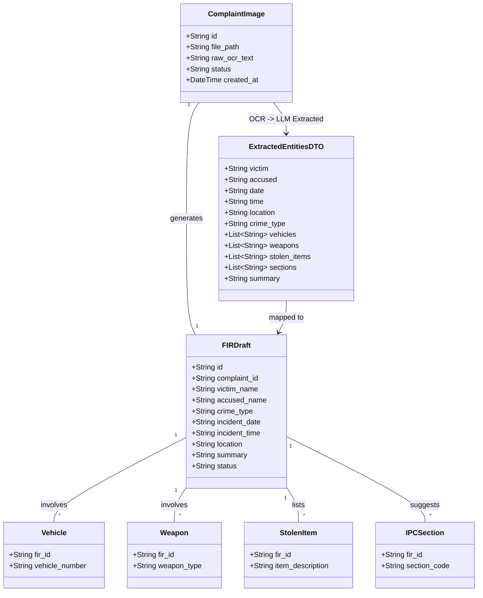

# FIRStruct AI (Offline FIR Generator)

## Requirements
Implement an offline-first, CPU-optimized AI application for police stations that ingests handwritten or printed citizen complaints (via images/PDFs), processes them through OpenCV for enhancement and PaddleOCR for text extraction, and uses local LLMs (via Ollama) to extract structured legal entities into a SQLite database, providing officers with a ready-to-review FIR draft via a Streamlit dashboard.

## Entities

## Approach
1. **System Architecture**:
   - Monolithic Python web application with a Streamlit frontend.
   - Sequential Data Pipeline: Upload -> OpenCV Preprocessing -> PaddleOCR -> Text Cleaning -> Ollama LLM Extraction -> JSON Validation -> SQLite Persistence.

2. **Technical Implementation**:
   - **Frontend**: Streamlit for dashboard, upload, search, and PDF export (using ReportLab).
   - **Computer Vision & OCR**: OpenCV for deskewing, noise removal, and contrast enhancement. PaddleOCR for robust offline handwritten text extraction.
   - **AI Extraction**: Pydantic schema validation wrapped around calls to a local Ollama instance (Qwen2.5:3B / Phi-3). Includes an automatic retry loop for JSON formatting errors.
   - **Storage**: SQLite for local, zero-config relational storage of FIRs and associated entities.

3. **Business Logic**:
   - FIR drafts are created with a "Draft" status. They require an officer's explicit approval before finalization.
   - Fallback logic for unreadable images: If PaddleOCR returns garbage/empty text, the system alerts the user instead of hallucinating through the LLM.

## Structure

### Dependencies
1. `Streamlit App` calls `Pipeline Controller`
2. `Pipeline Controller` orchestrates `Vision Service`, `OCR Service`, `AI Extractor`, and `Database Service`
3. `AI Extractor` depends on `LLM Client` and `JSON Validator`
4. `Export Service` reads from `Database Service`

### Layered Architecture
1. **Presentation Layer (`frontend/`)**: Streamlit pages (`upload.py`, `dashboard.py`, `search.py`).
2. **Vision & OCR Layer (`ocr/`)**: OpenCV scripts (`image_preprocessing.py`) and PaddleOCR wrappers (`paddle_reader.py`).
3. **AI Layer (`ai/`)**: Prompts, Pydantic schemas, and Ollama integration (`extractor.py`, `validator.py`).
4. **Data Access Layer (`database/`)**: SQLite CRUD operations (`sqlite.py`).
5. **Export Layer (`exports/`)**: PDF generation using ReportLab (`pdf_export.py`).

## Operations

### Implement Vision & OCR Layer - `ocr/image_preprocessing.py` & `ocr/paddle_reader.py`
1. Responsibility: Prepare images and extract handwritten text.
2. Methods:
   - `preprocess_image(image_bytes)`: Load via OpenCV, apply grayscale, Gaussian blur, adaptive thresholding, and basic deskewing. Return enhanced image.
   - `extract_text(enhanced_image)`: Initialize PaddleOCR (English model). Pass image array, extract text blocks, and concatenate into a single raw text string.

### Implement AI Validation & Extraction - `ai/validator.py` & `ai/extractor.py`
1. Responsibility: Ensure LLM outputs match strict FIR JSON requirements.
2. Methods:
   - `validator.py`: Define `ExtractedEntitiesDTO` using Pydantic `BaseModel`.
   - `extractor.extract_fir_entities(raw_text)`:
     - Prompt Ollama to extract specific fields (victim, accused, crime_type, etc.) and return ONLY JSON.
     - Parse the string, validate with Pydantic. If validation fails (e.g., hallucinated keys, missing arrays), retry up to 3 times by feeding the error back to the LLM. Throw `ExtractionError` if it fails completely.

### Implement Database Layer - `database/sqlite.py`
1. Responsibility: Store FIR drafts and relational metadata.
2. Methods:
   - `init_db()`: Create `firs`, `vehicles`, `weapons`, `stolen_items`, and `ipc_sections` tables.
   - `save_fir_draft(dto, complaint_id)`: Insert the validated DTO into the `firs` table with status 'Draft'. Extract array fields (vehicles, weapons) and insert into related tables with foreign keys.
   - `search_firs(query_params)`: Support searching by victim name, crime type, location, or vehicle number.

### Create Streamlit Pipeline - `app.py` & `frontend/upload.py`
1. Responsibility: User interface and pipeline orchestration.
2. Logic:
   - Render file uploader (accepting images/PDFs).
   - On upload: Display a progress bar (`st.progress`).
   - Run `preprocess_image` -> update UI.
   - Run `extract_text` -> update UI with raw text.
   - Run `extract_fir_entities` -> update UI with structured JSON.
   - Show a "Save Draft" button that calls `save_fir_draft()`.

### Implement PDF Export - `exports/pdf_export.py`
1. Responsibility: Generate printable FIR PDFs.
2. Methods:
   - `generate_fir_pdf(fir_id)`: Query DB for FIR details. Use ReportLab to draw a standard Police FIR template, populating extracted fields. Return PDF bytes.

## Norms
1. **Performance Logging**: Log execution time for OpenCV, PaddleOCR, and Ollama steps separately to diagnose CPU bottlenecks.
2. **Type Hinting & Pydantic**: Use strict Python type hints and Pydantic validation across system boundaries to prevent runtime type errors.
3. **Asynchronous UI**: Streamlit must provide visual feedback (spinners/progress bars) during the lengthy OCR and LLM inference steps so the user knows the system is actively working.

## Safeguards
1. **Absolute Offline Constraint**: Ensure PaddleOCR and Ollama models are downloaded locally. The application must not make any outbound network requests during execution.
2. **Data Type Resilience**: Arrays in the JSON (vehicles, weapons, stolen items, sections) must default to empty lists `[]` if the LLM cannot find relevant data, rather than `null` or missing keys.
3. **Garbage In, Graceful Out**: If PaddleOCR extracts less than 10 coherent words, bypass the LLM entirely, alert the user of "Unreadable Image", and require manual transcription.
4. **Hardware Limits**: Prevent concurrent processing of multiple complaints to avoid CPU/RAM exhaustion (OOM errors) during model inference.
